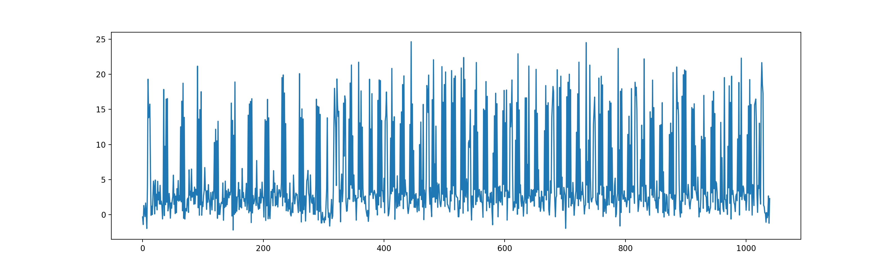

# Power

## Encrypted flag

`EF904825AA2B6339832E6B38ED1C3EE26B3937B647CC64EED46288987CF6CF322B46763B0564AC293DE2E42E75A856FF`

## Demo visulization of a single trace

```python
import numpy as np
import matplotlib.pyplot as plt

with open('traces.npy', 'rb') as f:
    record = np.load(f, allow_pickle=True).item()

print(record)

plt.plot(record['leakage'])
plt.show()
```


